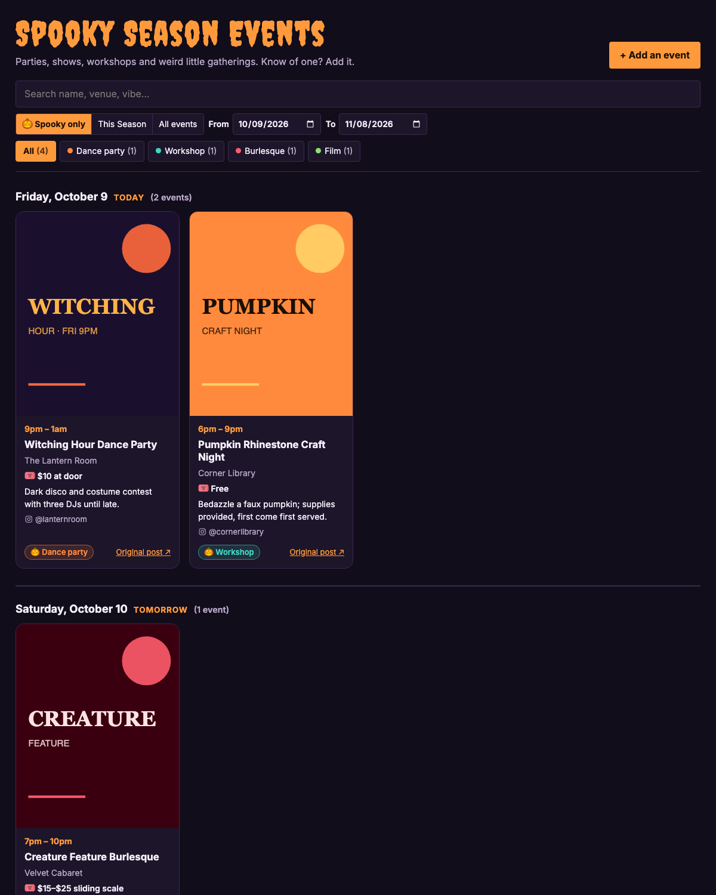
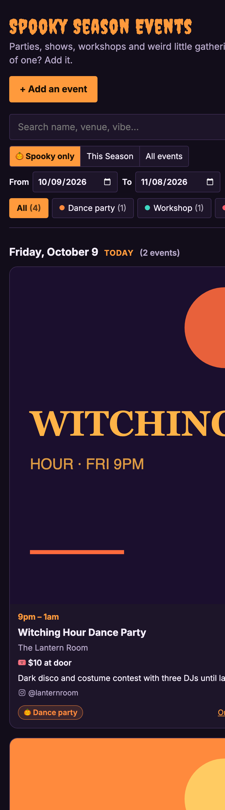

# Spooky Season Event Aggregator 🎃

Turn the event fliers your friends keep posting on Instagram and Facebook into one tidy, shareable list: sorted by day, filterable by type, with the flier front and center.

You share a post (or a screenshot of a flier) and Claude reads it: event name, date, time, venue, price, a one-line description and what kind of event it is. Everything lands in a Google Sheet you own, and a public page shows it to everyone else. Friends can add events too.

It runs entirely in your own Google account (Google Sheets + Apps Script). No server, no hosting bill. The only cost is the Claude API, about 1–2¢ per flier.



## What it does

- **Reads fliers for you.** Paste an Instagram, Facebook or event link, or upload a flier image. Claude pulls out the details and picks a type (dance party, workshop, burlesque, film, market…).
- **One row per date.** A weekly movie night becomes four listings, one per Monday.
- **A page people actually want to use.** Fliers grouped by day, color-coded type tags (click one to filter), search, a date range picker, and a 🎃 Spooky only / This Season / All events toggle.
- **Ordered by "get there by."** Within a day, events that end soonest come first, so people can plan a night of hopping.
- **Late-night aware.** A 10pm–2am party stays listed until 2am, not until midnight.
- **Price and NTAFLOF.** Every card shows the ticket price (or Free), and notes when no one is turned away for lack of funds.
- **Credits the source.** Cards link back to the Instagram account, Facebook page or website that posted the event. People adding events can opt out.
- **Anyone can add events** from the page, no Google account needed. Duplicates are caught automatically.
- **Invite-only mode.** If your list spreads further than you'd like, lock it with one menu click and send a private invite link to your friends. Replace the link any time to cut off old ones.
- **Accessible.** Keyboard and screen reader friendly, readable contrast, respects reduced motion.



## Set it up (about 10 minutes, no coding)

1. **[Make your own copy of the template sheet](https://docs.google.com/spreadsheets/d/12RIoAboIik_IPqx2G_PwnpzshwXVzqeGuJcN_Z97ZuA/copy)**. Google copies the sheet and its code into your account.
2. Open your copy and wait a few seconds for the **🎃 Events** menu. A **Start here** tab walks you through the rest:
   1. **🎃 Events → 1. Set up sheet.** Google asks for permission. Because this is your own private copy, Google shows "Google hasn't verified this app": choose **Advanced → Go to (unsafe) → Allow**.
   2. Fill in the **Settings** tab: page title, city, time zone, season start and end dates.
   3. Get a Claude API key at [console.anthropic.com](https://console.anthropic.com), then **🎃 Events → 2. Set Claude API key**.
   4. **Extensions → Apps Script → Deploy → New deployment → ⚙ Web app.** Execute as: **Me**. Who has access: **Anyone**. Click **Deploy** and copy the Web app URL.
   5. **🎃 Events → 3. Save public page link** and paste it. That URL is your page: share it!

### What the permissions are for

| Permission | Why |
|---|---|
| Sheets | Writes events to your sheet |
| Drive | Saves flier images to a folder in your Drive so they don't disappear when Instagram's links expire |
| External requests | Fetches the shared link and sends the flier to Claude |
| Triggers | Checks the "Add links here" tab every 10 minutes |

Your Claude key, the Shortcut key and your page link are stored in the script's private properties, never in the sheet.

## Adding events

| From | How |
|---|---|
| **The public page** | **+ Add an event**: paste a link, upload a flier, or type details |
| **Your iPhone** | Share any post or screenshot to the [iPhone Shortcut](docs/iphone-shortcut.md) |
| **The sheet** | Paste links into the **Add links here** tab (anyone you give edit access can do this) |

Instagram and Facebook often won't show a post's caption to outside servers. A shared link usually still gets the flier image. Uploading a screenshot always works best.

## Running the list

Everything is in the **🎃 Events** menu and the sheet itself:

- **Fix a listing:** edit its row. To remove one from the page, set **Status** to `hidden`.
- **Edited a time?** Run **Tidy up** so it re-sorts.
- **Invite-only:** **🔒 Lock page** gives you an invite link. **🔁 New invite link** cuts off the old one. **🔓 Unlock page** makes it public again.
- **Skipped tab:** posts that weren't events, or were dated before your season, land here so nothing is silently lost.

## Security

The page runs as you, so it was built defensively:

- Anonymous visitors can only read the list and submit events. Owner-only menu actions check that it's really you.
- Text from posts can't become spreadsheet formulas, so no one can use `=IMPORTDATA(...)` tricks to leak your sheet.
- Uploads must be real JPG/PNG/GIF/WebP images under 8 MB.
- The public form is rate limited (30 an hour, 120 a day) so spam can't run up your Claude bill.
- Claude is told that posts are untrusted data and can only return event details.
- Cards only ever link to `http(s)` URLs.

Found a hole? Please report it privately through GitHub's **Security → Report a vulnerability** on this repo rather than a public issue.

## For developers

The whole app is three files in [`src/`](src):

| File | What's in it |
|---|---|
| `Code.js` | Apps Script server: settings, the ingest pipeline, Claude call (structured outputs), dedupe, sorting, invite mode |
| `Index.html` | The public page: HTML, CSS and vanilla JS, served by `doGet` |
| `appsscript.json` | Manifest: scopes, web app settings, time zone |

To work on it with [clasp](https://github.com/google/clasp):

```bash
npm install -g @google/clasp
clasp login
clasp create --type sheets --title "Spooky Season (dev)" --rootDir src
clasp push
```

`clasp create` writes a `.clasp.json` with your project's IDs. It's in `.gitignore` so it never ends up in a pull request. See [`.clasp.json.example`](.clasp.json.example) to connect to an existing project instead.

Handy endpoints on a deployed page:

- `GET …/exec?format=json` returns the current events as JSON (add `&invite=CODE` when locked)
- `POST …/exec` with `{"token": "<Shortcut key>", "url": "…"}` or `{"token": "…", "imageBase64": "…"}` adds an event

## Contributing

Ideas, bug reports and pull requests are very welcome. See [CONTRIBUTING.md](CONTRIBUTING.md). Some ideas on the wishlist:

- Other seasons and themes (Pride month, holiday markets, summer concerts)
- A free AI option (e.g. Gemini) alongside Claude
- Calendar export (`.ics`) and "add to my calendar" buttons
- Translations

## License

[MIT](LICENSE). Made by [Melissa Dowell](https://melissadowell.com), for friends who post too many good fliers.
